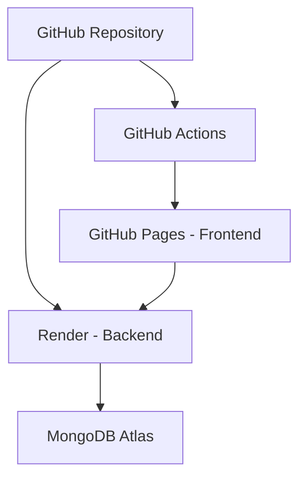

# 🚀 Plan de Deploy: Frontend + Backend

## 📋 Resumen de la Arquitectura



## 🎯 Recomendaciones Finales

### **Frontend → GitHub Pages** ✅

- **Gratuito** y perfecto para React/Vite
- Deploy automático con GitHub Actions
- CDN global integrado
- SSL automático

### **Backend → Render** 🌟

- **Mejor opción gratuita** para Node.js
- MongoDB Atlas integración fácil
- Auto-deploy desde GitHub
- Logs y monitoring incluidos

## 🚀 Pasos para Deploy

### 1. Preparar Backend (Render)

```bash
# 1. Crear cuenta en Render.com
# 2. Crear Web Service conectado a tu repo
# 3. Configurar variables de entorno
# 4. Deploy automático
```

### 2. Preparar Frontend (GitHub Pages)

```bash
# 1. Push el workflow de GitHub Actions
# 2. Configurar GitHub Pages en Settings
# 3. Agregar secret VITE_API_URL
# 4. Deploy automático
```

### 3. Configurar MongoDB

```bash
# 1. Crear cluster gratuito en MongoDB Atlas
# 2. Obtener connection string
# 3. Agregar a variables de Render
```

## 🔧 Configuraciones Necesarias

Ya he configurado:

- ✅ GitHub Actions workflow
- ✅ Vite config para GitHub Pages
- ✅ Documentación de deploy
- ✅ Scripts de Render ya existen

## ⚡ Alternativas de Backend

Si prefieres otra opción:

### **Railway** (Recomendación #2)

- Interface muy limpia
- Deploy fácil
- Plan gratuito generoso

### **Vercel** (Para APIs simples)

- Excelente para serverless
- Requiere adaptar código a funciones

### **Heroku** (Clásico)

- Muy conocido
- Plan gratuito limitado

## 💡 Próximos Pasos

1. **¿Quieres proceder con Render + GitHub Pages?**
2. **¿Necesitas ayuda configurando MongoDB Atlas?**
3. **¿Prefieres explorar Railway u otra alternativa?**

## 📊 Comparación de Costos

| Servicio      | Plan Gratuito | Limitaciones                    |
| ------------- | ------------- | ------------------------------- |
| GitHub Pages  | ✅            | 100GB bandwidth/mes             |
| Render        | ✅            | 750 hrs/mes, sleep after 15 min |
| MongoDB Atlas | ✅            | 512MB storage                   |
| **Total**     | **$0/mes**    | Perfecto para portfolio         |
