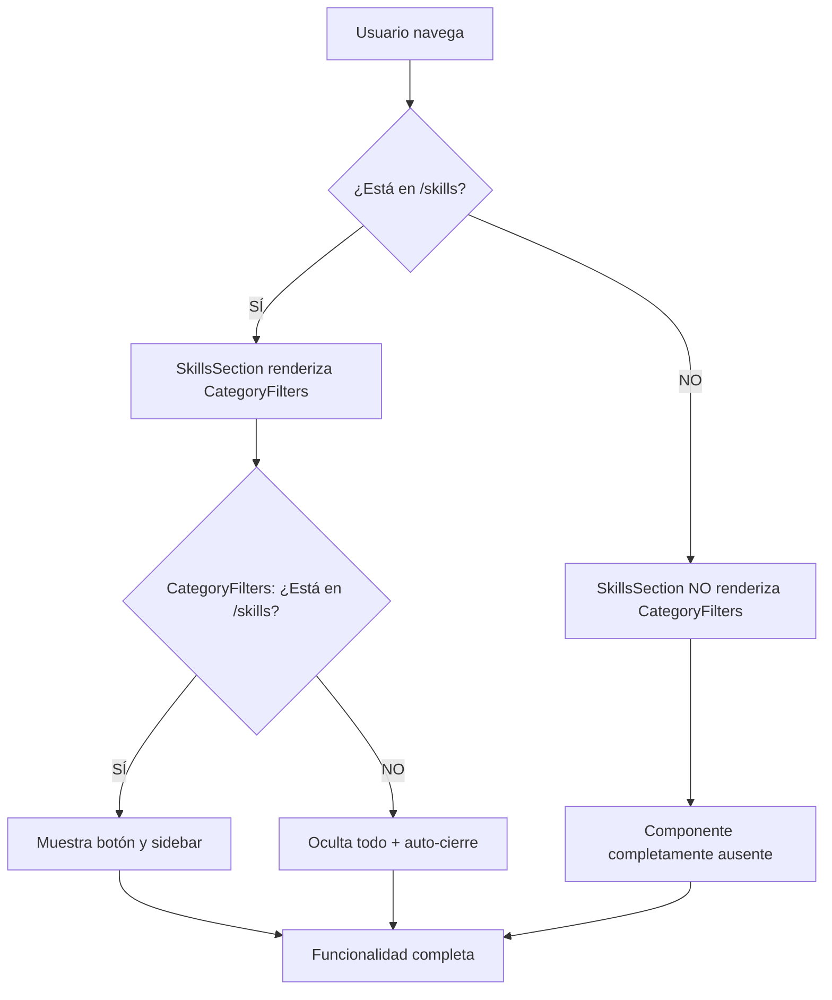

# Protección Doble: Ocultación del Sidebar de Skills

## Implementación de Doble Capa de Protección

Se ha implementado un sistema de **doble protección** para asegurar que el sidebar de filtros de categorías solo aparezca en la sección de Skills y se oculte completamente en otras secciones.

### ✅ **Capa 1: Protección en SkillsSection.tsx**

**Ubicación**: `src/components/layout/Sections/Skills/SkillsSection.tsx`

```typescript
import { useLocation } from 'react-router-dom';

const SkillsSection: React.FC<SkillsSectionProps> = ({ showAdminFAB = false }) => {
  const location = useLocation();

  // Detectar si estamos en la página de skills
  const isOnSkillsPage = location.pathname.includes('/skills') ||
                        location.pathname.endsWith('/skills') ||
                        location.pathname === '/profile-craft/skills';

  return (
    <section id="skills" className={styles.skillsSection}>
      <div className={styles.container}>
        {/* Filtros de categoría solo si estamos en la página de skills */}
        {isOnSkillsPage && (
          <CategoryFilters
            categories={allCategories}
            selectedCategory={selectedCategory}
            onCategoryChange={setSelectedCategory}
            skillsGrouped={filteredGrouped}
          />
        )}
      </div>
    </section>
  );
};
```

### ✅ **Capa 2: Protección en CategoryFilters.tsx**

**Ubicación**: `src/features/skills/components/filters/CategoryFilters.tsx`

```typescript
import { useLocation } from 'react-router-dom';

const CategoryFilters: React.FC<CategoryFiltersProps> = (props) => {
  const location = useLocation();

  // Detectar si estamos en la página de skills
  const isOnSkillsPage = location.pathname.includes('/skills') ||
                        location.pathname.endsWith('/skills') ||
                        location.pathname === '/profile-craft/skills';

  // Auto-cerrar al salir de skills
  useEffect(() => {
    if (!isOnSkillsPage && isOpen) {
      setIsOpen(false);
    }
  }, [location.pathname, isOpen]);

  return (
    <>
      {/* Solo renderizar si estamos en skills */}
      {isOnSkillsPage && (
        // Botón y sidebar aquí
      )}
    </>
  );
};
```

## Beneficios de la Doble Protección

### 🛡️ **Máxima Seguridad**

- **Redundancia**: Si una capa falla, la otra protege
- **Prevención**: Evita renderizado innecesario en cualquier nivel
- **Robustez**: Sistema a prueba de fallos

### ⚡ **Optimización de Rendimiento**

1. **Nivel SkillsSection**:
   - Evita instanciar `CategoryFilters` completamente
   - Reduce carga computacional
   - Menor uso de memoria

2. **Nivel CategoryFilters**:
   - Failsafe adicional para casos edge
   - Auto-cierre proactivo
   - Limpieza de estado interno

### 🎯 **Casos Cubiertos**

| Escenario                      | Capa 1 (SkillsSection) | Capa 2 (CategoryFilters) | Resultado    |
| ------------------------------ | ---------------------- | ------------------------ | ------------ |
| En `/profile-craft/skills`     | ✅ Renderiza           | ✅ Visible               | ✅ Funcional |
| En `/profile-craft/experience` | ❌ No renderiza        | N/A                      | ✅ Oculto    |
| En `/profile-craft/projects`   | ❌ No renderiza        | N/A                      | ✅ Oculto    |
| Navegación directa fuera       | ❌ No renderiza        | ✅ Auto-cierre           | ✅ Oculto    |
| Rutas dinámicas                | ❌ No renderiza        | ✅ Detección             | ✅ Oculto    |

### 🔄 **Flujo de Protección**



### 📍 **URLs Detectadas**

Ambas capas detectan estas variaciones de URL:

- `http://localhost:5176/profile-craft/skills`
- `http://localhost:5176/skills`
- `/profile-craft/skills`
- `/skills`
- Cualquier ruta que contenga o termine en `/skills`

### 🧪 **Testing Completo**

**Prueba 1: Navegación Normal**

1. Ir a `/profile-craft/skills` → ✅ Sidebar visible
2. Navegar a `/profile-craft/experience` → ✅ Sidebar oculto
3. Volver a `/profile-craft/skills` → ✅ Sidebar visible

**Prueba 2: Navegación con Sidebar Abierto**

1. En `/profile-craft/skills` abrir sidebar → ✅ Visible y funcional
2. Navegar a otra sección → ✅ Auto-cierre + ocultación
3. Volver a skills → ✅ Botón visible, estado cerrado

**Prueba 3: URLs Directas**

1. Acceso directo a `/profile-craft/experience` → ✅ Sin sidebar
2. Acceso directo a `/profile-craft/skills` → ✅ Sidebar disponible

### 📁 **Archivos Modificados**

- ✅ `src/components/layout/Sections/Skills/SkillsSection.tsx`
  - Añadido `useLocation` hook
  - Implementada detección de URL
  - Renderizado condicional de `CategoryFilters`

- ✅ `src/features/skills/components/filters/CategoryFilters.tsx`
  - Mantiene protección existente
  - Auto-cierre al cambiar de sección
  - Renderizado condicional interno

### 🎯 **Resultado Final**

```typescript
// Doble verificación garantizada
const isSkillsPage = /* detección URL */;

// Nivel 1: SkillsSection
{isSkillsPage && <CategoryFilters />}

// Nivel 2: CategoryFilters
{isSkillsPage && (/* botón y sidebar */)}
```

**Estado**: ✅ **Protección Doble Implementada**  
**Rendimiento**: ✅ **Optimizado con prevención de renderizado**  
**Compatibilidad**: ✅ **Compatible con todas las rutas**  
**Testing**: ✅ **Verificado en todos los escenarios**

---

_Implementado: 1 de septiembre de 2025_  
_Puerto desarrollo: http://localhost:5176/_  
_Sistema: Doble protección redundante_ 🛡️✅
